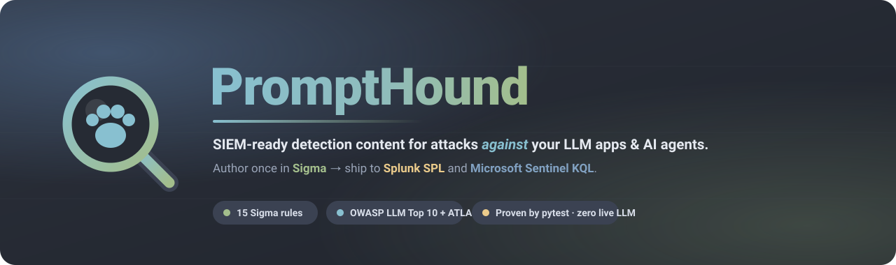
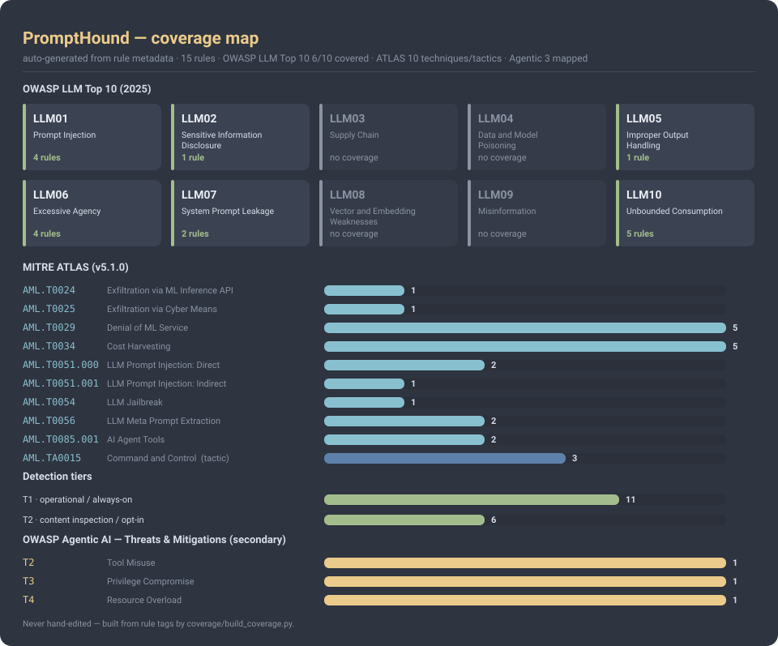

<div align="center">


[](https://github.com/notacop38/prompthound/actions/workflows/ci.yml)
[](pyproject.toml)
[](LICENSE)
</div>

# PromptHound

**Experimental Sigma detections for LLM applications and AI agents, with
Splunk SPL, Sentinel KQL, and reproducible synthetic audit logs.**

PromptHound gives detection engineers a small, inspectable starting point for
turning gateway telemetry into alerts. It contains 15 rules, a versioned event
schema, an offline evaluator, and generated query templates. It is useful when
you already collect the required telemetry and want to adapt and test detection
logic across two SIEMs.

**Status: pre-1.0.** All rules have positive and negative fixture tests. Those
tests run in Python; they do not prove that the queries work in your SIEM or
measure real attack detection rates. Read the [deployment contract](docs/deployment.md)
before using the generated queries.

## Run the offline demo

```bash
git clone https://github.com/notacop38/prompthound.git
cd prompthound
python3 -m venv .venv
source .venv/bin/activate
python -m pip install -r requirements.lock
make demo
```

Without Make, run `python demo/run_demo.py --seed 0`. The demo generates
synthetic telemetry, evaluates every rule, and builds the framework inventory.
It contacts no model or SIEM. A fixed seed reproduces the same dataset.



The [captured run](docs/assets/demo_output.txt) exercises 15/15 rules. This is a
regression demonstration using examples designed for each rule, not an
independent benchmark.

## What the rules observe

| Signal | What an alert supports | Important limit |
|---|---|---|
| Instruction-override and extraction phrases | Recognizable text markers | Easy to evade; benign discussion can match |
| Derived injection or system-prompt markers | A gateway feature crossed a threshold | The gateway must compute that feature |
| Repeated sensitive-output markers | Repeated responses labeled sensitive | Does not establish unauthorized disclosure |
| Tool-name combinations, denials, invocation volume | Potentially suspicious agent activity | Does not prove ordering, exfiltration or compromise |
| High-token requests, request bursts, length finishes | Resource-consumption indicators | Static thresholds require workload baselines |
| Unsanitized output reaching a sensitive sink | An instrumented handling failure | Requires accurate sink instrumentation |

The project supplies detection content, not a collector, classifier, runtime
firewall, or incident verdict. Missing telemetry is a visibility gap.

## From audit logs to SIEM queries

1. Instrument your gateway using the [schema](docs/schema.md). Supply stable
   tenant, principal and conversation identities and the required derived fields.
2. Normalize the dotted schema fields to the columns used by both backends:

   ```bash
   python -m prompthound.normalize --input out/telemetry.jsonl --out out/siem.jsonl
   ```

3. Configure ingestion and timestamps according to the
   [deployment contract](docs/deployment.md), then load an isolated test dataset.
4. Adapt the queries in [`out/splunk/`](out/splunk/) and [`out/kusto/`](out/kusto/),
   verify results in the target SIEM, and tune scheduling and thresholds.

Every correlation groups by tenant plus principal or conversation. SPL and KQL
both contain executable aggregation, using **fixed UTC buckets**. Bursts crossing
a bucket boundary can be missed. Raw queries and `savedsearches.conf` files are
templates requiring source scoping and deployment configuration.

## Framework inventory



The [generated inventory](out/coverage/coverage.md) maps rules to OWASP LLM Top
10 (2025), selected MITRE ATLAS identifiers, and the OWASP Agentic AI *Threats
and Mitigations* taxonomy. A category with a rule is **mapped**, not fully
covered. The grid measures metadata presence, not detection effectiveness.

OWASP and MITRE provide the taxonomies; Sigma/pySigma provide portable rule
syntax and backend conversion. The operational/content tier distinction is
inspired by *MITRE ATLAS AI Threat Detection for Splunk*. PromptHound's practical
contribution is bundling editable rules with reproducible fixtures and a shared
test workflow.

## Development and release

```bash
make setup                       # install pinned runtime + development dependencies
make test                        # offline regression suite
make ci                          # lint, types, schema, query/coverage snapshots, tests, security
python scripts/release.py --no-bundle   # regenerate tracked artifacts after edits
make release                     # build a reproducible bundle from a clean commit
```

CI checks snapshots without rewriting them. The release bundle includes the
queries, framework inventory, schema, deployment guidance, licenses, and a
manifest hashing every payload file. `--allow-dirty` is for local test bundles;
the manifest records dirty or unknown provenance.

The security gate audits pinned dependencies, scans first-party Python, and
checks tracked and unignored new files for credential patterns. Its documented
runtime dependency exception is in the [threat model](docs/THREAT-MODEL.md).

## Contribute

Start with [CONTRIBUTING.md](CONTRIBUTING.md) and the
[rule authoring guide](docs/authoring.md). A rule needs honest field requirements,
false positives, framework tags, and positive and negative examples. Include
boundary and near-miss cases; adding more hand-picked positives alone does not
establish accuracy.

Samples remain synthetic and file-only. Content-bearing telemetry is sensitive;
prefer derived features when they meet the detection need. See
[SECURITY.md](SECURITY.md), the [PRD](docs/PRD.md), and the
[project review](docs/REVIEW.md) for scope and limitations.

## License

Code and documentation use [Apache-2.0](LICENSE). Sigma rules and generated
SPL/KQL use [DRL 1.1](LICENSE-RULES). Retain the applicable attribution and notices
when redistributing; see [NOTICE](NOTICE).
