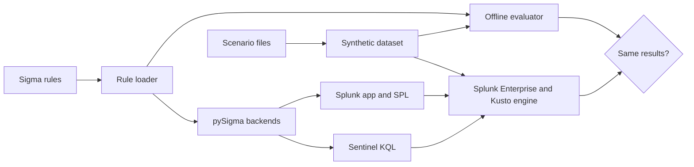

<p align="center">
  
</p>

<h1 align="center">PromptHound</h1>

<p align="center">
  Sigma detection rules for LLM applications and AI agents, with Splunk and
  Microsoft Sentinel queries verified to return the same results as the rules.
</p>

<p align="center">
  <a href="pyproject.toml"></a>
  <a href="#license"></a>
  
</p>

PromptHound turns the audit events of an LLM gateway or agent runtime into
alerts. It provides:

- **16 Sigma rules** covering prompt injection, system-prompt extraction,
  jailbreaks, data exfiltration, agent tool abuse, denial of service and cost
  abuse, and insecure output handling. Each is mapped to the OWASP Top 10 for LLM Applications 2025 and to
  MITRE ATLAS or ATT&CK, and where relevant to the OWASP Top 10 for Agentic
  Applications 2026.
- **An audit event schema** aligned with the OpenTelemetry semantic conventions
  for generative AI.
- **Generated SIEM content:** a Splunk app with one saved search per rule, and
  KQL queries for Microsoft Sentinel.
- **An offline evaluator and test harness:** 83 scenario cases, a synthetic
  data generator, and a check that runs every query in Splunk Enterprise and the
  Kusto engine and compares the results with the evaluator's.
- **A command-line tool** that validates telemetry, reports which rules it
  supports, evaluates the rules and converts them.

> [!NOTE]
> PromptHound is experimental (version 0.3.0). The rules are tested on
> synthetic data; qualify them on your own traffic before alerting on them. See
> [Verification](#verification) and [Limitations](#limitations).

## Rules

<!-- rules:start -->
| Category | Rule | Level | Logic | Telemetry | OWASP | ATLAS / ATT&CK |
|---|---|---|---|---|---|---|
| Agent tool abuse | [High Tool-Call Volume in One Conversation](docs/rules.md#tool-call-amplification-loop) | medium | Correlation | Metadata only | LLM10, LLM06, ASI02 | AML.T0034.002 |
|  | [Repeated Denied Tool Calls in One Conversation](docs/rules.md#denied-tool-retry-loop) | medium | Correlation | Metadata only | LLM06, ASI03 | AML.T0053 |
|  | [Sensitive-Read and Egress Tools in One Agent Tool Chain](docs/rules.md#anomalous-tool-call-chain) | medium | Single event | Metadata only | LLM06, ASI02 | AML.T0086, AML.T0085.001 |
| Data exfiltration | [Repeated Sensitive Data in LLM Output for One Principal](docs/rules.md#pii-secret-exfiltration-in-output) | high | Correlation | Content detector | LLM02 | AML.T0057 |
| Denial of service and cost abuse | [Completion Request Burst from One Principal](docs/rules.md#request-rate-burst-per-principal) | medium | Correlation | Metadata only | LLM10 | AML.T0034.000, AML.T0029 |
|  | [Repeated High-Token Completions for One Principal](docs/rules.md#token-cost-spike-per-principal) | medium | Correlation | Metadata only | LLM10 | AML.T0034.001 |
|  | [Repeated Length-Truncated Completions in One Conversation](docs/rules.md#repeated-length-finish-loops) | low | Correlation | Metadata only | LLM10 | AML.T0034 |
|  | [Very Large Output Budget Requested](docs/rules.md#oversized-max-tokens) | low | Single event | Metadata only | LLM10 | AML.T0034.001 |
| Insecure output handling | [Unsanitized LLM Output Reached an Interpreter or Renderer](docs/rules.md#unsanitized-output-to-sink) | high | Single event | Metadata only | LLM05, ASI05 | T1059 |
| Jailbreak | [Repeated Blocked Jailbreak Attempts in One Conversation](docs/rules.md#persona-safety-bypass-loop) | medium | Correlation | Raw content | LLM01 | AML.T0054 |
| Prompt injection | [Injection Phrase in Retrieval-Augmented Input from Untrusted Sources](docs/rules.md#indirect-injection-from-untrusted-source) | medium | Single event | Raw content | LLM01 | AML.T0051.001 |
|  | [Instruction-Override Phrase in LLM Input](docs/rules.md#direct-injection-markers) | medium | Single event | Raw content | LLM01 | AML.T0051.000 |
|  | [Multiple Injection Markers Scored on LLM Input](docs/rules.md#direct-injection-marker-count) | medium | Single event | Content detector | LLM01 | AML.T0051.000 |
| System prompt extraction | [Instruction-Disclosure Phrase in LLM Output](docs/rules.md#system-prompt-disclosure-phrases) | low | Single event | Raw content | LLM07 | AML.T0056 |
|  | [System-Prompt Content Detected in LLM Output](docs/rules.md#system-prompt-leaked-in-output) | high | Single event | Content detector | LLM07 | AML.T0056 |
|  | [System-Prompt Extraction Phrase in LLM Input](docs/rules.md#extract-system-prompt-markers) | medium | Single event | Raw content | LLM07 | AML.T0056 |
<!-- rules:end -->

*Telemetry* is the most sensitive data a rule needs: **Metadata only**, the
output of a **Content detector** (for example an injection-marker count), or
**Raw content** (prompt or response text). The [rule catalog](docs/rules.md)
gives each rule's logic, fields, mappings and false positives. A mapping records
which risk a rule relates to; it does not claim that the rule covers the risk.

## Quick start

Requires Python 3.11 or later.

```bash
git clone https://github.com/NotACop38/PromptHound.git
cd PromptHound
python3 -m venv .venv
source .venv/bin/activate
make setup
prompthound demo
```

`make setup` installs the locked, hash-checked dependencies and the package;
`pip install .` also works when you only need the command. The demo builds a
synthetic dataset of benign background traffic and every scenario case,
evaluates all rules over it, and checks each case on its own. It contacts no
model and no SIEM.

```text
PromptHound demo: synthetic telemetry, evaluated offline

Dataset: 420 events — 48 background, 372 from 83 scenario cases (seed 0)

Rule                                                                  Level   Cases  Alerts
--------------------------------------------------------------------  ------  -----  ------
High Tool-Call Volume in One Conversation                             medium    5/5       2
Repeated Denied Tool Calls in One Conversation                        medium    7/7       2
Sensitive-Read and Egress Tools in One Agent Tool Chain               medium    7/7       3
Repeated Sensitive Data in LLM Output for One Principal               high      6/6       2
Completion Request Burst from One Principal                           medium    5/5       3
Repeated High-Token Completions for One Principal                     medium    5/5       2
Repeated Length-Truncated Completions in One Conversation             low       4/4       3
Very Large Output Budget Requested                                    low       5/5       2
Unsanitized LLM Output Reached an Interpreter or Renderer             high      6/6       3
Repeated Blocked Jailbreak Attempts in One Conversation               medium    6/6       2
Injection Phrase in Retrieval-Augmented Input from Untrusted Sources  medium    6/6       3
Instruction-Override Phrase in LLM Input                              medium    5/5       8
Multiple Injection Markers Scored on LLM Input                        medium    5/5      23
Instruction-Disclosure Phrase in LLM Output                           low       4/4       2
System-Prompt Content Detected in LLM Output                          high      3/3       1
System-Prompt Extraction Phrase in LLM Input                          medium    4/4       3

83 of 83 scenario cases behave as expected; background traffic raised 0 alerts.
Alerts include rules firing on other rules' scenarios; each case is also checked alone.
```

## Using it with your telemetry

Emit one JSON object per model call, tool call or agent invocation, following
the [schema](docs/schema.md), as JSON Lines. Then:

| Command | Purpose |
|---|---|
| `prompthound validate events.jsonl` | Check every event against the schema. |
| `prompthound readiness events.jsonl` | Report which rules the telemetry supports and which fields are missing. |
| `prompthound evaluate events.jsonl` | Run the rules offline and list the alerts. |
| `prompthound normalize events.jsonl -o siem.jsonl` | Convert events to the column layout the SIEM queries read. |
| `prompthound convert -o queries/` | Write the SPL and KQL, optionally for your own Splunk macro or Sentinel table. |
| `prompthound rules` | List the rules and their mappings. |

`evaluate`, `readiness` and `rules` take `--format json`. For telemetry without
a system-prompt leak detector or a personal-data detector, `readiness` reports:

```text
Status   Rule                                                                  Missing fields
-------  --------------------------------------------------------------------  -------------------------------------
blocked  System-Prompt Content Detected in LLM Output                          content.output.contains_system_prompt
partial  Repeated Sensitive Data in LLM Output for One Principal               content.output.pii.types
ready    Completion Request Burst from One Principal
...
```

The sensitive-data rule still works through its credential branch, so it is
*partial* rather than *blocked*. To deploy the queries, follow
[docs/deployment.md](docs/deployment.md): ingestion, the Splunk app, the
Sentinel table, correlation windows, and qualification before alerting.

## How it works



- The **rule loader** parses each rule with pySigma and rejects any detection
  feature whose results would differ between the offline evaluator, Splunk and
  KQL, such as null checks, negated numeric comparisons or case folding of
  non-ASCII letters. The [supported subset](docs/authoring.md#supported-sigma-subset)
  has one meaning in all three.
- The **offline evaluator** compiles the parsed rules into predicates and counts
  correlations in fixed UTC windows, as the generated `bin`/`stats` and
  `summarize ... bin()` queries do.
- The **converters** are pySigma's Splunk and Kusto backends, with PromptHound's
  field mapping and corrections for string arrays, wildcard lists, booleans and
  non-ASCII letters.
- **Scenario files** state which event sequences must alert and which must not.
  The generator places every case in its own time slot beside benign background
  traffic, so one dataset tests the evaluator and the SIEM queries.

## Verification

| Check | Scope |
|---|---|
| Scenario cases | 83 cases across the 16 rules: the targeted behavior, near misses, thresholds, window boundaries and tenant isolation. |
| Mutation tests | Weakening any rule breaks at least one of its cases. |
| Conformance cases | 39 cases that pin down matching semantics: case folding, non-ASCII letters, escaped JSON text, numbers, arrays and negation. |
| Engine verification | Every saved search, every KQL file and every conformance case runs in Splunk Enterprise and the Kusto engine; each result must equal the offline evaluator's. |
| CI gate | ruff, strict mypy, pytest with at least 95% branch coverage, generated-artifact drift, pip-audit, bandit and a secret scan. |

The last engine run, on 26 September 2026 with Splunk Enterprise 10.4.3 and the
Kusto emulator 1.0.9763.20628, loaded 463 events; all 16 rules and all 39
conformance cases matched. [docs/verification.md](docs/verification.md) has the
output and explains how to reproduce it with `make verify-siem`.

Verification shows that each query does what its rule states. It does not show
how many real attacks a rule detects or how many false positives it raises on
your traffic.

## Limitations

- **Synthetic evidence.** The scenario cases are written for each rule. They are
  regression tests, not a measurement of detection rates.
- **Instrumentation.** The rules need fields that many gateways do not emit yet:
  tenant and conversation identities, tool-chain state, output sinks and the
  outputs of content detectors. Rules that read detector outputs are only as
  accurate as those detectors.
- **Signal strength.** Phrase rules match recognizable wording and are easy to
  evade. Correlation thresholds are starting points, and the tool-chain rule
  needs your own tool inventory.
- **Fixed windows.** A burst that straddles a window boundary is split and can
  stay below a correlation threshold.
- **Sentinel.** The KQL is verified in the Azure Data Explorer engine, not in a
  Log Analytics workspace, and the Logs Ingestion API truncates field values
  longer than 64 KB.
- **Scope.** PromptHound is detection content and offline tooling. It does not
  block traffic and contacts no model.

## Repository layout

```text
rules/             Sigma rules, one file per rule, by category
scenarios/         Scenario cases, one file per rule
siem/              Generated Splunk app, SPL and KQL
src/prompthound/   Python package: loader, evaluator, converters, generator and CLI
tests/             Test suite and conformance cases
scripts/           CI gate, artifact generation, SIEM verification, release and ATLAS update
docs/              Schema, rule catalog, authoring, deployment, verification and threat model
```

## Documentation

- [Audit event schema](docs/schema.md)
- [Rule catalog](docs/rules.md) and [MITRE ATLAS Navigator layer](docs/atlas-navigator-layer.json)
- [Writing rules and scenarios](docs/authoring.md)
- [Deploying to Splunk and Microsoft Sentinel](docs/deployment.md)
- [Verification](docs/verification.md)
- [Threat model](docs/threat-model.md)
- [Changelog](CHANGELOG.md)

## Contributing

Rules, scenario cases and fixes are welcome; see [CONTRIBUTING.md](CONTRIBUTING.md).
Report vulnerabilities privately as described in [SECURITY.md](SECURITY.md).

## License

The detection content, meaning the rules in `rules/` and the queries and Splunk
app generated from them in `siem/`, is licensed under the
[Detection Rule License 1.1](LICENSE-RULES). Everything else is licensed under
the [Apache License 2.0](LICENSE). [NOTICE](NOTICE) lists third-party
attributions.
